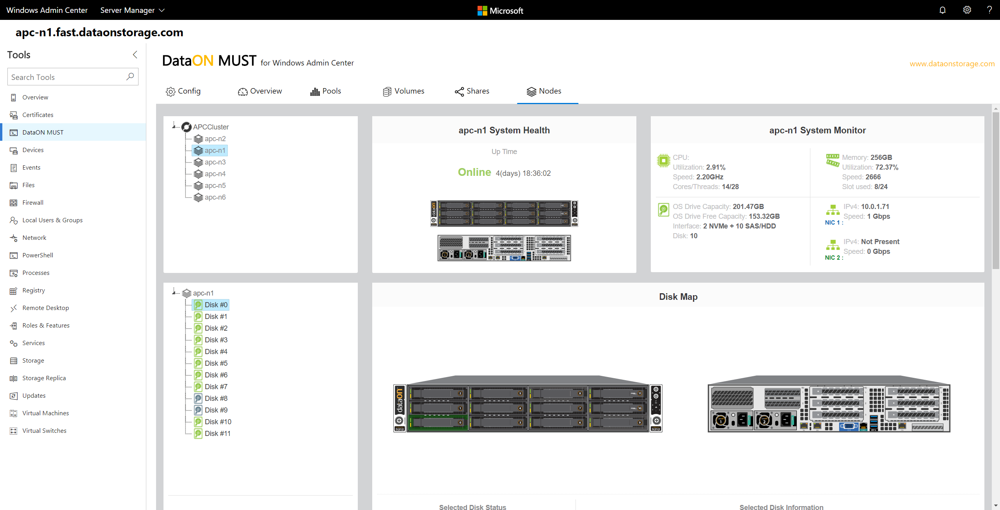
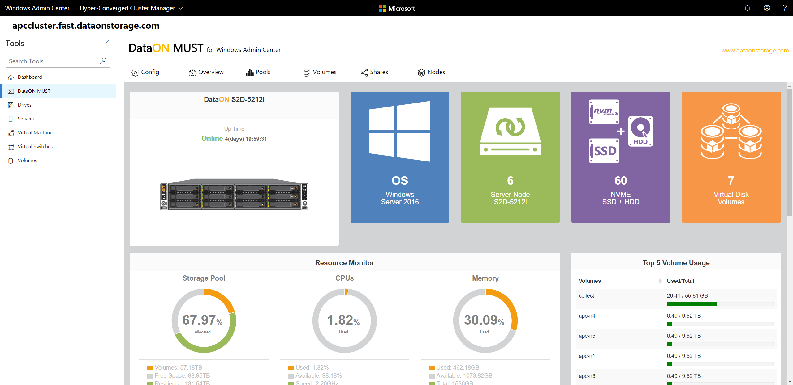

# DataON Extension

## Integrated monitoring and management for hyper-converged infrastructure

[DataON](http://www.dataonstorage.com/) is the industry-leading provider of hyper-converged infrastructure and storage systems optimized for Microsoft Windows Server environments, with over 600 enterprise deployments and over 120PB of Storage Spaces Direct deployments. The [DataON MUST](http://www.dataonstorage.com/must) software delivers SAN-like storage monitoring features through a single pane of glass, providing real-time dashboard level metrics for IOPS, latency, and throughput on cluster nodes and volumes. With system alerts based on Windows Health Service faults and SAN-like call home services, systems administrators can be automatically notified of hardware failures, configuration issues and resource saturation.

DataON saw the value of integrating MUST capabilities with Windows Admin Center in the early Technical Preview phase and expressed strong interest in extension and integration scenarios. The close collaboration between the engineering teams at DataON and Microsoft helped define extensibility scenarios and validate the SDK for broader preview readiness.

> <cite>“We’ve taken our standalone MUST visibility, monitoring, and management tool and enabled it to work within Windows Admin Center. Customers will benefit from the expanded capabilities that MUST provides, and the combination of MUST and Windows Admin Center from a single console will provide the ultimate management experience for Windows Server-based infrastructure.”</cite>
>
> -- Howard Lo, Vice President of Sales and Marketing, DataON

DataON’s MUST extension for Windows Admin Center is a prime example of the value that integrating two complementary products can deliver to customers, bringing monitoring and management and end-to-end insight into hardware and software together in a unified experience.

As DataON’s MUST primarily targets management of cluster deployments, it was obvious to integrate with the hyper-converged cluster view within Windows Admin Center, providing visibility into the hardware, performance and resource consumption across an entire cluster.

Early customer feedback from preview users have proven the value of integration and also helped identify gaps and areas of improvement in the SDK which will be addressed in future updates of Windows Admin Center and the SDK.