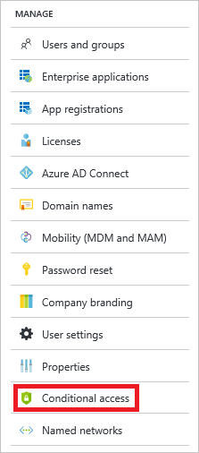
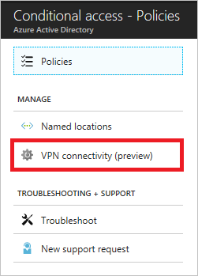
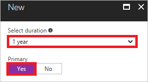

# Step 7.2. Create conditional access root certificates for VPN authentication with Azure AD

>Applies To: Windows Server (Semi-Annual Channel), Windows Server 2016, Windows Server 2012 R2, Windows 10

&#171;  [**Previous:** Step 7.1. Configure EAP-TLS to ignore Certificate Revocation List (CRL) checking](vpn-config-eap-tls-to-ignore-crl-checking.md) 
&#187; [ **Next:** Step 7.3. Configure the Conditional Access policy](vpn-config-conditional-access-policy.md)

In this step, you configure conditional access root certificates for VPN authentication with Azure AD, which automatically creates a Cloud app called VPN Server in the tenant. To configure conditional access for VPN connectivity, you need to:

1. Create a VPN certificate in the Azure portal (you can create more than one certificate).
2. Download the VPN certificate.
2. Deploy the certificate to your VPN and NPS servers.

When a user attempts a VPN connection, the VPN client makes a call into the Web Account Manager (WAM) on the Windows 10 client. WAM makes a call to the VPN Server cloud app. When the Conditions and Controls in the Conditional Access policy are satisfied, Azure AD issues a token in the form of a short-lived (1-hour) certificate to the WAM. The WAM places the certificate in the user's certificate store and passes off control to the VPN client.  

The VPN client then sends the certificate issues by Azure AD to the VPN for credential validation.  Azure AD uses the certificate that is marked as **Primary** in the VPN connectivity blade as the Issuer. 

In the Azure portal, you create two certificates to manage the transition when one certificate is about to expire. When you create a certificate, you choose whether it is the primary certificate, which is used during the authentication to sign the certificate for the connection.

**Procedure:**

1. Sign in to your [Azure portal](https://portal.azure.com) as a global administrator.

2. On the left menu, click **Azure Active Directory**. 

    

3. On the **Azure Active Directory** page, in the **Manage** section, click **Conditional access**.

    

4. On the **Conditional access** page, in the **Manage** section, click **VPN connectivity (preview)**.

    

5. On the **VPN connectivity** page, click **New certificate**.

    

6. On the **New** page, perform the following steps:

    

    a. For **Select duration**, select either 1 or 2 years. You can add up to two certificates to manage transitions when the certificate is about to expire. You can choose which one is the primary (the one used during authentication to sign the certificate for connectivity).

    b. For **Primary**, select **Yes**.

    c. Click **Create**.

## Next step
[Step 7.3. Configure the Conditional Access policy](vpn-config-conditional-access-policy.md): In this step, you configure the conditional access policy for VPN connectivity. 

---